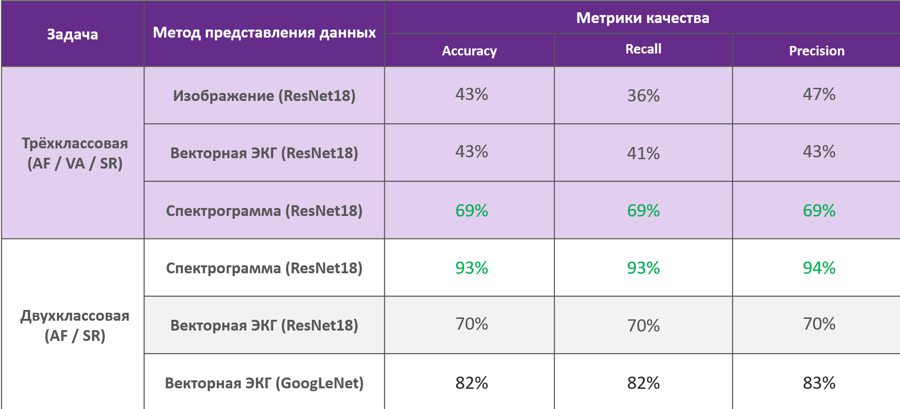

# Разработка метода обработки сигнала ЭКГ для эффективной оценки сердечного ритма пациента с использованием нейронной сети

## Данный проект разрабатывался в рамках учебной дисциплины "Проектирование систем дистанционного мониторинга".

В рамках данного исследования основной задачей было разработать алгоритм классификации сигнала ЭКГ с использованием нейронной сети для эффективной оценки сердечного ритма пациента.

Задачи включали в себя:

- Обучение нейронной сети на данных ЭКГ, подбор гиперпараметров, подбор архитектуры сети

- Классификацию сердечного ритма пациентов на три и два основных класса (синусовый ритм, фибрилляция предсердий и прочие аритмии)

- Выбор оптимального представления данных

## Результаты

## Выводы

- Из рассмотренных вариантов представления данных наименее информативным оказалось представление изображением, в то время как наивысшую информативность имеет спектральное представление.

- Низкие результаты решения трёхклассовой задачи связаны с некомпактностью класса аритмий (VA).

- Выборку данных необходимо дополнительно обрабатывать: среди записей существуют сильно зашумленные, которые нужно дополнительно фильтровать. Также присутствуют выбросы.

## Структура проекта

Данные в силу своего большого размера размещены на Google диске. 

- [*Dataset/*](./Dataset) - папка с данными и скриптом по их извлечению и представлению в нужном виде

- [*Neural network/*](./Neural%20network) - папка с результатами классификации на разных архитектурах и на разных входных форматах данных 

- [*Report/*](./Report) - папка с отчетом по командному проекту.

- [*Scripts/*](./Scripts) - папка со скриптами обработки входных данных и конструированию из них нужного представления (ВЭКГ, изображения). 

- [*Torch notebooks/*](./Torch%20notebooks) - папка с обучением ResNet и GoogleNet на PyTorch. Вынесено в отдельную папку, так как папка NN написана на tensorflow.

- [*Wavelet/*](./Wavelet) - папка с обработкой сигналов из датасета с помощью непрерывного вейвлет-преобразования
